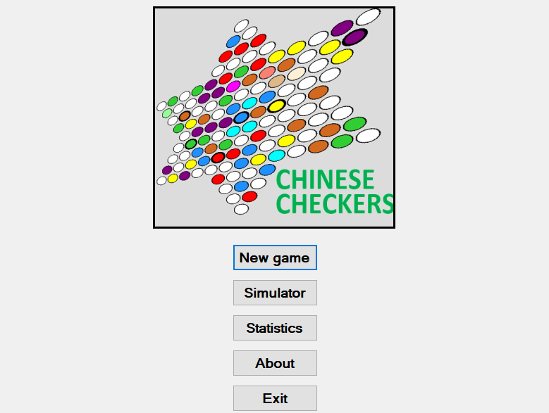
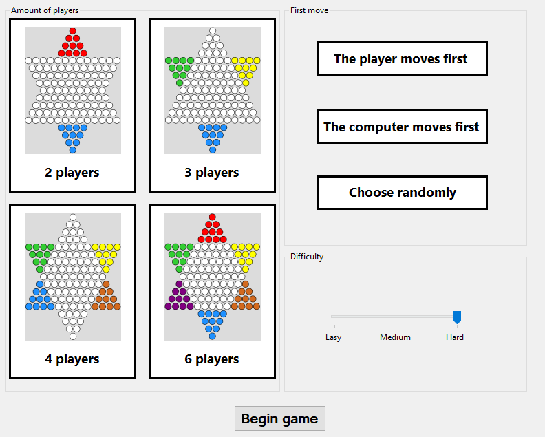
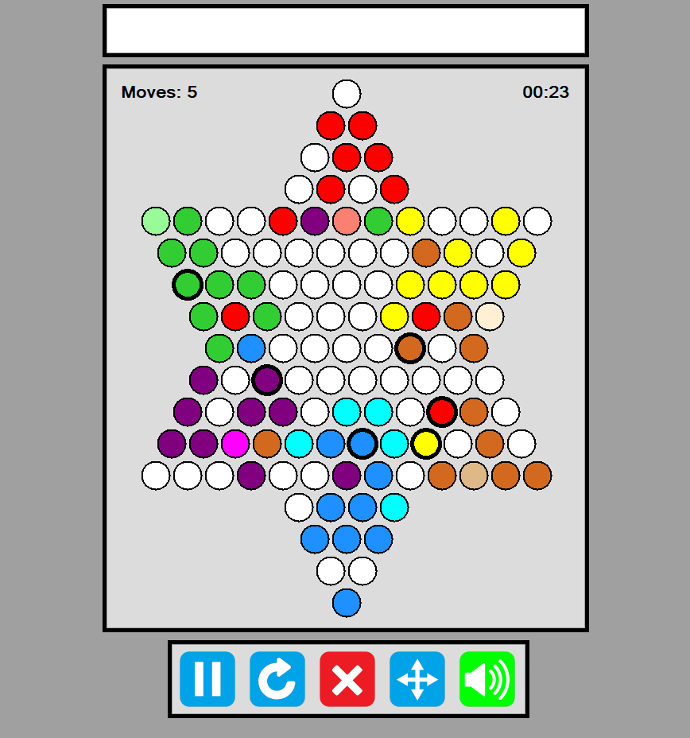

# Chinese Checkers
My implementation of a board game called Chinese Checkers in C#.
Features:
- the user can play against one to five computer opponents
- there are three difficulty settings for the computer oponents; easy, medium and hard
- arbitary amount of computer players with arbitary difficulty settings can compete against each other in a simulator, the results of these simulations are stored
- the user can decide which player is going to have the first turn
- numerous GUI features, such as letting the user know of the current state of the game via panel, or buttons that allow the user to mute or unmute sounds and pause, restart or exit the game with a single click

This application was first developed in Czech ([https://github.com/josefmicak/cinska-dama](https://github.com/josefmicak/cinska-dama)), but since it's by far my biggest project and it might be helpful to someone working on a similar project I decided to publish it in English as well. 
The application has been created as a part of the Čínská dáma bachelor thesis, which has been successfully defended on the Faculty of Electrical Engineering and Computer Science at VSB - Technical University of Ostrava in the academic year 2020/2021.
This repository includes the entire practical part of the thesis, the theoretical part will be linked here as soon as it's made public.

Some pictures of the application:

